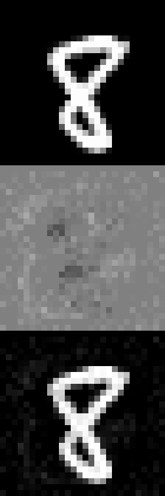

# NeuralNetwork
 This is a simple neural network that recognizes the MNIST database of handwritten digits. In addition, it can create its own adversarial images through a white-box algorithm inspired by the idea of using backpropagation in reverse, effectively adjusting the input to encourage a certain output rather than adjusting the weights and biases of the network itself.
 
 This method adds noise to a given image in order to force the network to identify it as a digit of the user's choice. In the example below, the original image of an 8 (top) has noise added (middle) to get the final adversarial image (bottom), which the network identifies as a 3.

It is important to understand adversarial attacks in order to to prevent exploitations of neural networks by would-be hackers.
